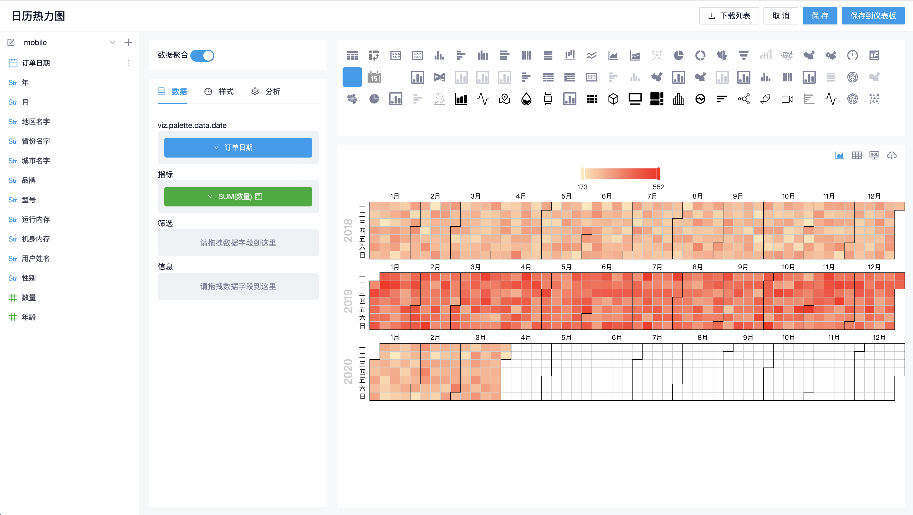
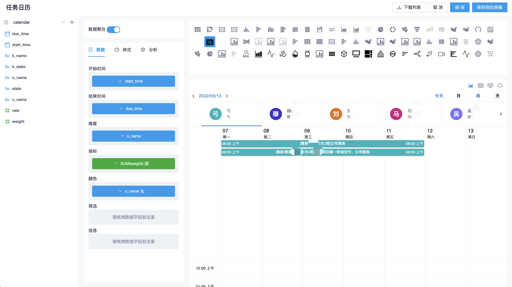
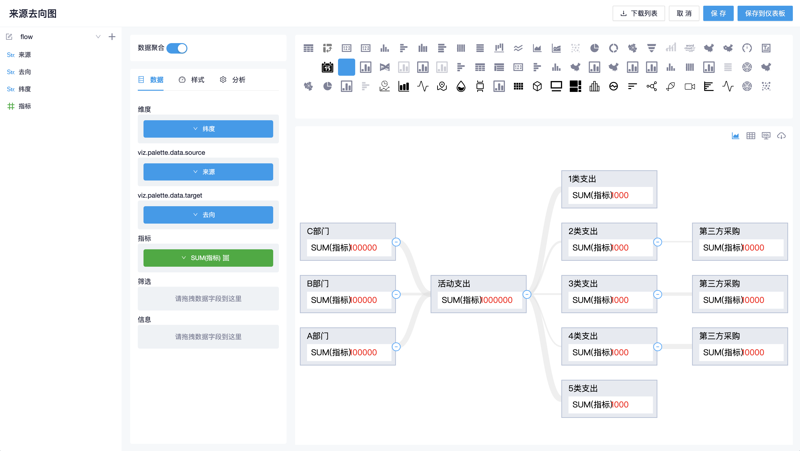

## 参赛者

nil

## 参赛作品

- 日历热力图
- 任务日历
- 来源去向图

## 开发与使用

本作品对源码做了二次开发，需要按照以下说明进行开发和使用

### 1. 开发

- 需要在 `package.json` 中加入以下依赖项

  ```json
  {
    "@ant-design/graphs": "^1.1.0",
    "@emotion/react": "^11.9.0",
    "@emotion/styled": "^11.8.1",
    "@mui/icons-material": "^5.6.0",
    "@mui/lab": "^5.0.0-alpha.76",
    "@mui/material": "^5.6.0"
  }
  ```

- 将 `nilCharts` 目录拷贝到 `frontend/src/app/components/ChartGraph` 路径下
- 在 `frontend/src/app/utils/chartHelper.ts` 中加入以下代码

  ```ts
  import head from "lodash/head";
  import last from "lodash/last";

  /**
   * 日期处理函数
   */
  export function formatDate(dataset: any[], format = "YYYY") {
    return [...new Set(dataset.map((r) => moment(r).format(format)))];
  }

  export function maxNumber(array = []) {
    return last(array.sort((a, b) => a - b));
  }

  export function minNumber(array = []) {
    return head(array.sort((a, b) => a - b));
  }
  ```

- 在 `frontend/src/app/pages/ChartWorkbenchPage/models/ChartManager.ts` 导出插件

  ```ts
  import {
    BasicCalendarChart,
    BasicCalendarScheduler,
    BasicFlowAnalysis,
  } from 'app/components/ChartGraph/nilCharts';

  // 注意！这个方法在源码里有，导出下面3个插件即可
  private _basicCharts(): IChart[] {
    return [
      new BasicCalendarChart(),
      new BasicCalendarScheduler(),
      new BasicFlowAnalysis(),
    ];
  }
  ```

- `npm install`
- `npm start`

### 2. 在 datart 服务中使用

正常打包前端工程即可

### 3. 使用说明





