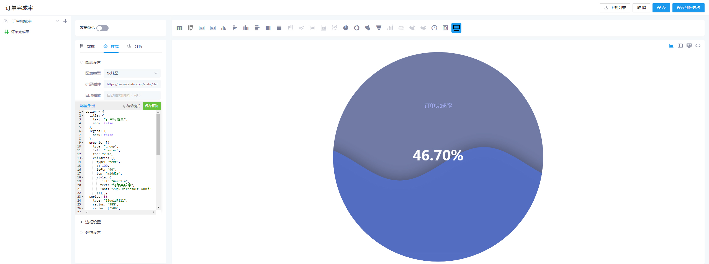

## 参赛者

shawon

## 参赛作品

- 大屏图表

## 开发与使用

本作品为依照 [datart-extension-charts](https://github.com/running-elephant/datart-extension-charts) 仓库模板开发的标准图表插件

### 1. 开发

`code` 为前端工程目录，开发指引参考 [datart-extension-charts](https://github.com/running-elephant/datart-extension-charts) 首页说明

### 2. 在 datart 服务中使用

`code/dist` 目录下的 `datart-dv.iife.js` 文件拷贝到 datart 服务的 `static/custom-chart-plugins` 路径下即可直接使用

### 3. 使用说明

datart-dv-charts 插件支持功能

1. 快速选择常用图表
2. 引入 echarts 扩展插件
3. 个性化编辑配置项（可对数据和图表操作，自由发挥）
4. 自动播放 tooltip
5. 图表边框设置
6. 图表装饰设置

demo：[生产大屏](https://datart.allchips.com/share?from=dv&token=yWJWbG7bOS7JIGTClgbWc4O3MFpaaXT6bHfIg04BD9G9dwrAlErpNp0kvdAJCAfa5pGhI/RnBkiHS1HZzcwG6V38vCvyjLxUWk9qlB3RQFd3hJk3lvWV5bnD0c8tbScr/lG+KfThMiSXqsV3BgmmSadvBm23R8MRisBdmOZbVuwS0Txz6UgNCjDdzWF7fAyfFIe0wd2XUUsQq4xxMmFl6frd1TYHSY1/5xbaTPgsd4M=)

