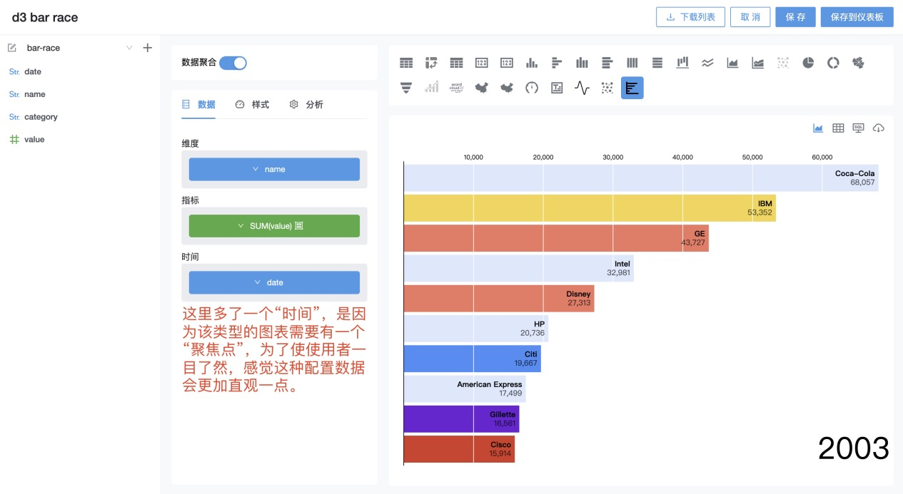
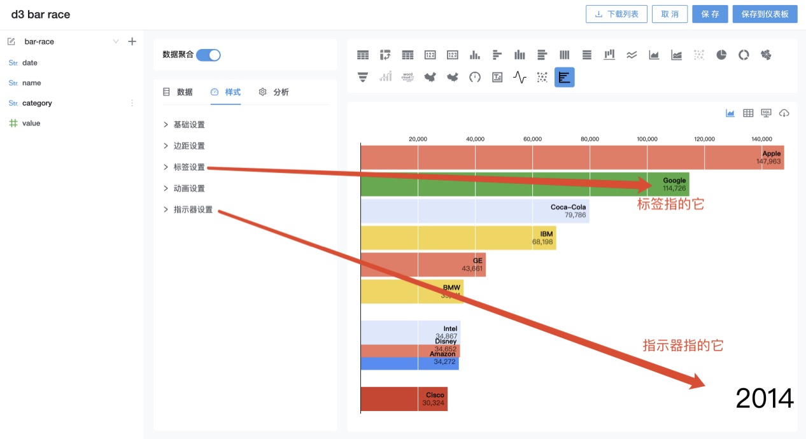
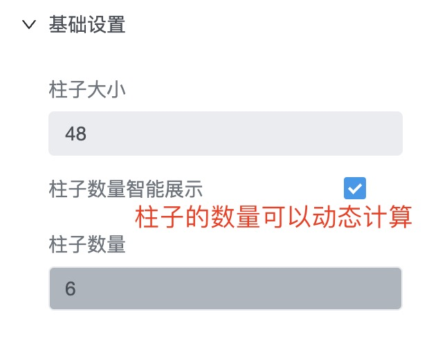
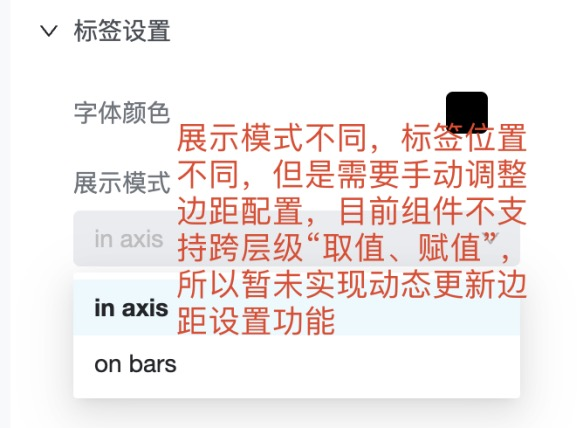
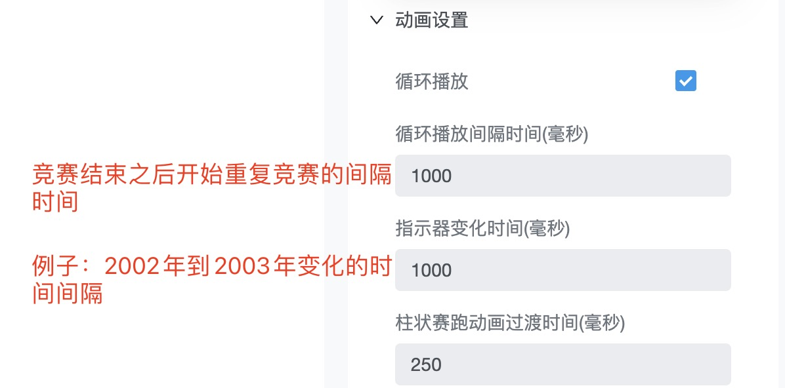

## 参赛者

天河

## 参赛作品

- 柱状竞赛图

## 开发与使用

本作品为标准图表插件，在源码和服务中都可以直接引入

### 1. 开发

将 `d3js-bar-chart.js` 文件拷贝到源码的 `public/custom-chart-plugins` 路径下即可

### 2. 在 datart 服务中使用

将 `d3js-bar-chart.js` 文件拷贝到 datart 服务的 `static/custom-chart-plugins` 路径下即可直接使用

### 3. 使用说明

